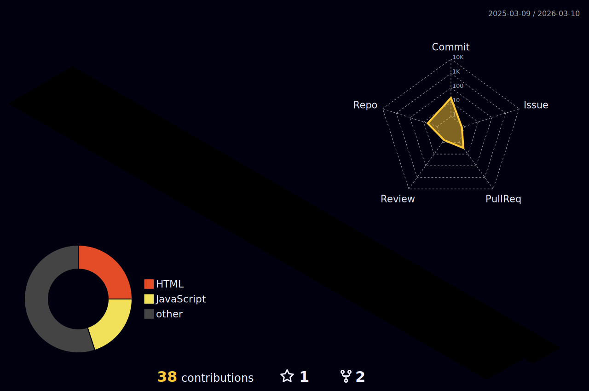

<h1 align="center">Ana Luiza Muniz Sousa<h1>

---

---

## Sobre

- Estudante de Desenvolvimento de Software Multiplataforma na FATEC Diadema
- Experiência prática em desenvolvimento web com JavaScript, Node.js, Express, Sequelize, SQL, HTML, CSS, Tailwind CSS e React
- Conhecimentos em Modelagem de Banco de Dados (conceitual, lógica e física), POO, Estrutura de Dados e Sistemas Operacionais
- Vivência com prototipação no Figma, design system, hierarquia visual e criação de interfaces navegáveis
- Interesse em desenvolvimento web full stack e boas práticas de código

## Projetos em destaque

- **TEIA** – Desenvolvimento de telas e componentes utilizando React, boas práticas de rotas, organização de pastas e integração visual
- **Sistema MEI** – Página de login interativa com contador dinâmico, manipulação de DOM e comportamento visual orientado ao usuário
- **Projeto de Pizzaria** – Construção de interface e lógica de sistema para gestão simples, seguindo padrões de desenvolvimento web

## Contato

- LinkedIn: 
- GitHub: 
- E-mail: 

---

> Evolução constante através da prática, disciplina e aprendizado contínuo.